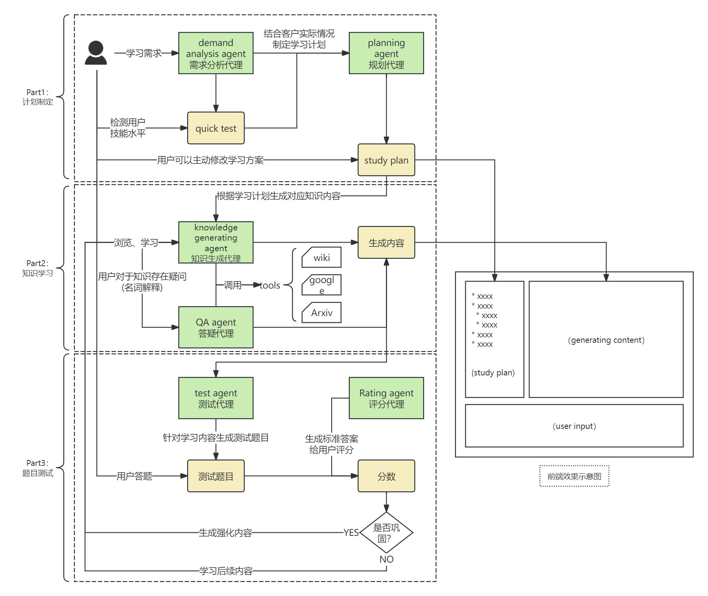

# 夫子 FuZi
> ”师者，所以传道受业解惑也。——韩愈“  

## 0. 项目简介
**夫子**（**FuZi**）是一个基于agentscope框架实现的muti-agent AI学习助手，旨在帮助用户完成全流程的技能自学。  
主要功能包括：学习路线规划、知识学习和讲解、自测考试和评分以及针对性强化等。
  
我们希望通过LLM的规划能力和生成能力，为希望实现技能自学的人打破信息壁垒，获取定制化的、实时的、可靠的知识内容。  
让我们一起，”用魔法打败魔法“！

## 1. 使用方法
### step0：环境准备
```commandline
python >= 3.10
```
### step1：下载代码
```
git clone https://github.com/ShanHaiAI/FuZi_agentscope.git
```
### step2：环境配置
修改`core/configs/model.config`，在对应字段填写您的API key。  
并根据requirement.txt文件，安装依赖。
```python
pip install -r requirements.txt
```
### step3：启动程序
```
# in console
cd core
python study_agent.py
```

## 2. road map
* 基础功能完善
  * 【紧急】前端页面
  * 【普通】通过config文件初始化agent
  * 【一般】判断退出
  * 【一般】用户提问，teacher名词解释
  * 【一般】根据得分提供强化意见，用户选择继续强化学习或学习后续内容
  * 【一般】检查学习进度
* 功能优化
  * challenger_agent：质疑代理。
  * customized plan maker：定制化规划。
  * tools：工具。

## 3. About us
山海AI是一个由AI从业者、高校学生和技术爱好者一起组成的非盈利的开源项目团队，旨在学习研究前沿AI技术，共享知识成果，服务于开源社区。  
